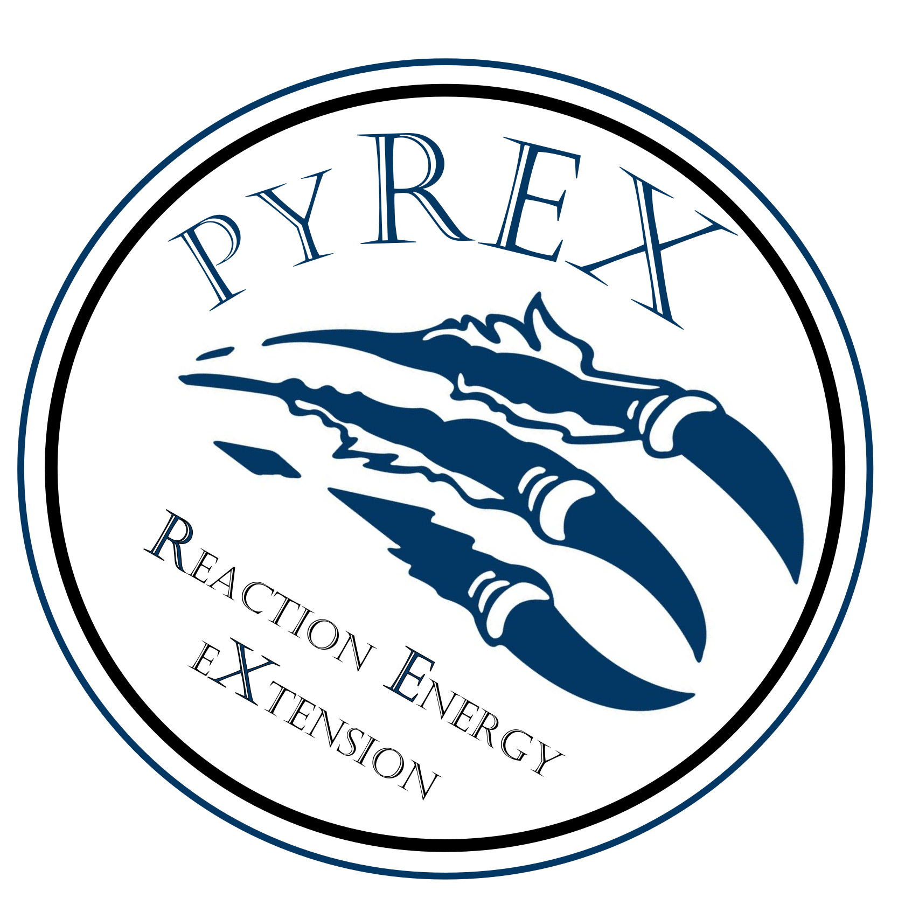
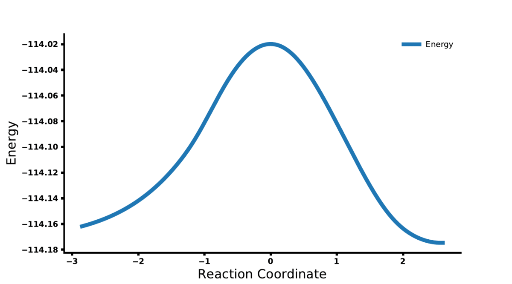

### Overview

pyREX(Python Reaction Energy eXtension), is a free open-source implementation of reaction coordinate analysis techniques that interfaces with PSI4 ab-initio quantum chemistry software in order to streamline the process of investigating energetic/electronic properties along an intrinsic reaction coordinate. This code is currently under development within the Derricotte Research Group at Morehouse College in Atlanta, GA. Current Key features include:(1) Calculating SCF energies along the reaction coordinate, (2) Reaction Force Analysis, (3) Reaction Electronic Flux (REF) Analysis, (4) Decomposition of REF into Polarization and Transfer Components, (5) Symmetry Adapted Perturbation Theory Decomposition analysis



### Installation
1. Obtain required software
    1. [pyREX](https://github.com/WDerricotte/pyrex) (must clone this repository; no binary install currently available)
    2. [Psi4](http://psicode.org/psi4manual/1.1/build_obtaining.html) pyREX depends intrinsically on Psi4, currently the easiest way to obtain the code is to download the available binaries available at http://vergil.chemistry.gatech.edu/psicode-download/1.1.html
    3. Export the necessary paths either through the command line or .bashrc
    ``` 
    export PATH=$PATH:/path/to/pyrex/src/directory/pyrex:
    export PYTHONPATH=$PYTHONPATH:/path/to/pyrex/src/directory/pyrex:
    ```
    4. The main "pyrex.py" module should now be executable from anywhere in your directory tree by simply typing "pyrex.py".  
